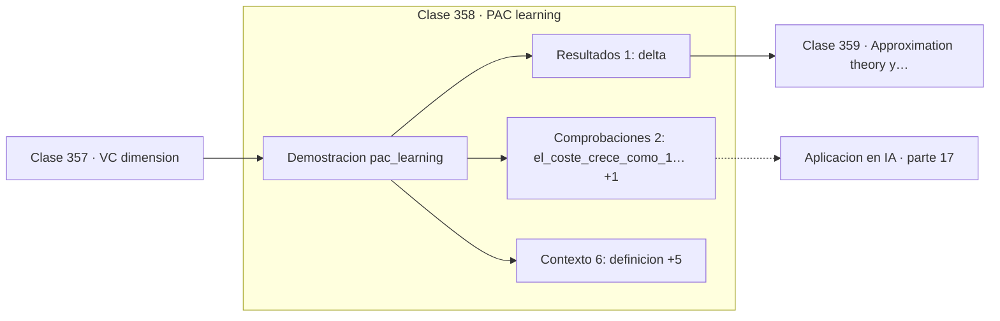

# 358 — PAC learning

> [⬅️ 357 VC dimension](../357-vc-dimension/README.md) · [📚 Parte 17](../README.md) · [🏠 Programa](../../../README.md) · [359 Approximation theory y scaling ➡️](../359-approximation-theory-y-scaling/README.md)

**Parte:** 17 — Frontera matemática para IA e investigación · **Nivel:** `frontera-investigacion` · **Horas estimadas:** 4
**Motor:** `engines.part17` · **Demostración:** `pac_learning` · **Clase 18 de 20** de la parte

---

## 🎯 Propósito

**Reducir el error a la mitad duplica los datos; subir la confianza cuesta un logaritmo.**

Procesos gaussianos, MCMC avanzado, inferencia variacional, transporte óptimo, geometría diferencial e informacional, SDE, Neural ODE, score matching y teoría del aprendizaje.

## ✅ Resultados de aprendizaje

Al terminar podrás:

1. Explicar **PAC learning** con lenguaje cotidiano y con notación matemática.
2. Resolver un caso pequeño a mano y anticipar el orden de magnitud del resultado.
3. Ejecutar y modificar `lab.py`, que corre la demostración `pac_learning`.
4. Interpretar las 9 salidas del laboratorio y decir qué comprueba cada una.
5. Detectar el error típico de esta parte: interpretar una cota teórica como predicción del error real.

## 🧩 Fórmulas de la clase

```text
con probabilidad ≥ 1−δ, error ≤ ε
n ≈ (1/ε)·(VC + log(1/δ))
crece como 1/ε y como log(1/δ)
```

## 🗺️ Ubicación en el programa



## 📖 Fundamentos

El marco PAC —probablemente aproximadamente correcto— formaliza qué significa aprender.
No se exige acertar siempre ni exactamente: se exige que, con probabilidad al menos
`1−δ`, el error de la hipótesis elegida sea a lo sumo `ε`. Dos parámetros, dos formas de
fallar admitidas.

La **complejidad muestral** es el número de ejemplos necesarios para garantizar eso, y su
forma revela una asimetría muy útil. Crece como `1/ε`: reducir el error a la mitad
**duplica** los datos necesarios. Pero crece solo como `log(1/δ)`: pasar de un 95 % a un
99,9 % de confianza cuesta muy poco. **Precisión es cara, confianza es barata.**

La dependencia de la complejidad de la clase es lineal en la dimensión VC. Con `ε = 0,1` y
`δ = 0,05`, una clase de VC 10 necesita 261 ejemplos y una de VC 100 necesita 2 331. Diez
veces más capacidad, diez veces más datos: la relación es directa y da una intuición
correcta sobre el coste de la complejidad.

Hay que ser explícito sobre su alcance. Las cotas son **válidas y muy holgadas**: aplicadas
a una red moderna piden más ejemplos que átomos hay en el universo observable. Su valor es
cualitativo —cómo escalan las cosas— no cuantitativo. Interpretarlas como predicción del
error real es un error de lectura, y decirlo evita presentar la teoría como algo que no es.

## 🧮 Ejemplo trabajado

Muestras necesarias para distintos ε y complejidades.

```text
δ = 0,05  (confianza del 95 %)

con ε = 0,1:
  clase de 1 000 hipótesis:    100 ejemplos
  VC = 10:                     261 ejemplos
  VC = 100:                  2 331 ejemplos

Escalado:
  ε a la mitad  →  datos × 2
  δ a la décima →  datos + log(10), casi nada
  VC × 10       →  datos × 10 aproximadamente

Precisión es cara; confianza es barata.

Aplicado a una red con 10⁹ parámetros, la cota
pediría un número de ejemplos absurdo. La teoría
es correcta; la cota, inservible en la práctica.
```

## 🔬 Qué ejecuta el laboratorio

`pac_learning` — PAC: cuántas muestras hacen falta para (ε, δ).

| Grupo | Salidas |
|---|---|
| 🔢 Resultados numéricos (1) | `delta` |
| ✅ Comprobaciones de invariante (2) | `el_coste_crece_como_1/ε`, `es_una_cota_del_peor_caso` |

Las claves booleanas no son adorno: si alguna fuera `False`, el resultado numérico
no sería fiable aunque el programa terminase sin error.

```bash
python classes/part-17-frontera-matematica-para-ia-e-investigacion/358-pac-learning/lab.py
compmath run 358
```

> [!TIP]
> Antes de ejecutar, **escribe tu predicción**. Un laboratorio que confirma lo que
> esperabas enseña tanto como uno que te contradice, pero solo si la predicción
> existía antes del resultado.

## ⚠️ Errores conceptuales frecuentes

1. Usar la cota PAC como estimación del error real.
2. Suponer que más confianza cuesta tanto como más precisión.
3. Aplicar el marco PAC sin comprobar el supuesto de datos iid.

## 🚀 Dónde se usa de verdad

Fundamentos teóricos del aprendizaje, dimensionamiento conceptual de conjuntos de datos,
comparación de familias de modelos y análisis de aprendibilidad.

## 🤖 Conexión con IA

Score matching fundamenta los modelos de difusión; el transporte óptimo aparece en flow matching; la teoría estadística del aprendizaje explica el scaling.

## 📓 Notebooks

| Archivo | Para qué |
|---|---|
| [`notebook.ipynb`](notebook.ipynb) | recorrido guiado con la demostración ejecutada |
| [`notebook_student.ipynb`](notebook_student.ipynb) | versión con `TODO` para resolver |
| [`notebook_solution.ipynb`](notebook_solution.ipynb) | solución de referencia verificada |

## 📝 Evaluación

| Criterio | Peso |
|---|---:|
| Comprensión conceptual | 25 % |
| Resolución manual | 25 % |
| Implementación y verificación | 25 % |
| Interpretación y comunicación | 15 % |
| Conexión con aplicación real | 10 % |

Detalle y criterios de error crítico en [`assessment.md`](assessment.md).

## ❓ Preguntas de comprobación

1. ¿Cuál es la entrada, cuál la salida y qué unidades tienen?
2. ¿Qué operación domina el comportamiento del resultado?
3. ¿Qué caso extremo revelaría un error conceptual?
4. ¿Cómo verificarías el resultado por un método independiente?
5. ¿Dónde aparece esto en investigación aplicada?

Si necesitas releer el código para responderlas, la clase todavía no está superada.

## 📥 Entregable

`notebook_student.ipynb` resuelto más un párrafo que explique el resultado **sin citar
código**: qué entra, qué sale, qué invariante se comprueba y qué pasaría en un caso límite.

## 🔗 Referencias

- [Valiant, L. *A theory of the learnable*, Communications of the ACM, 1984](https://doi.org/10.1145/1968.1972) — *uso:* artículo de origen consultado en «PAC learning».
- [Shalev-Shwartz, S.; Ben-David, S. *Understanding Machine Learning*, Cambridge, 2014](https://www.cs.huji.ac.il/~shais/UnderstandingMachineLearning/) — *uso:* obra de referencia consultada en «PAC learning».

Bibliografía completa de la parte en [`../../../docs/BIBLIOGRAPHY.md`](../../../docs/BIBLIOGRAPHY.md) · localizador verificable de cada obra en [`sources/bibliography.json`](../../../sources/bibliography.json).

## 📂 Material de la clase

[`intuition.md`](intuition.md) · [`theory.md`](theory.md) · [`derivation.md`](derivation.md) · [`exercises.md`](exercises.md) · [`assessment.md`](assessment.md) · [`where-is-this-used.md`](where-is-this-used.md) · [`lesson.yaml`](lesson.yaml)

---

> [⬅️ 357 VC dimension](../357-vc-dimension/README.md) · [📚 Parte 17](../README.md) · [🏠 Programa](../../../README.md) · [359 Approximation theory y scaling ➡️](../359-approximation-theory-y-scaling/README.md)
