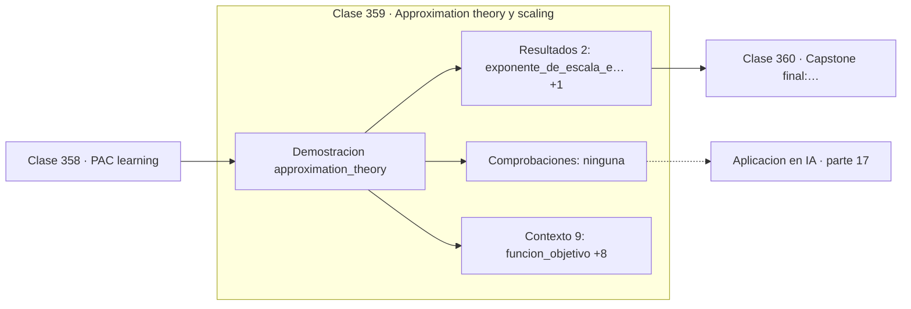

# 359 — Approximation theory y scaling

> [⬅️ 358 PAC learning](../358-pac-learning/README.md) · [📚 Parte 17](../README.md) · [🏠 Programa](../../../README.md) · [360 Capstone final: reproducir una idea matemática de un paper ➡️](../360-capstone-final-reproducir-una-idea-matematica-de-un-paper/README.md)

**Parte:** 17 — Frontera matemática para IA e investigación · **Nivel:** `frontera-investigacion` · **Horas estimadas:** 4
**Motor:** `engines.part17` · **Demostración:** `approximation_theory` · **Clase 19 de 20** de la parte

---

## 🎯 Propósito

**El error decae como una potencia del tamaño, y ese exponente es lo que predice el escalado.**

Procesos gaussianos, MCMC avanzado, inferencia variacional, transporte óptimo, geometría diferencial e informacional, SDE, Neural ODE, score matching y teoría del aprendizaje.

## ✅ Resultados de aprendizaje

Al terminar podrás:

1. Explicar **Approximation theory y scaling** con lenguaje cotidiano y con notación matemática.
2. Resolver un caso pequeño a mano y anticipar el orden de magnitud del resultado.
3. Ejecutar y modificar `lab.py`, que corre la demostración `approximation_theory`.
4. Interpretar las 11 salidas del laboratorio y decir qué comprueba cada una.
5. Detectar el error típico de esta parte: reportar resultados de mcmc sin diagnóstico de convergencia.

## 🧩 Fórmulas de la clase

```text
error ≈ C·(parámetros)^α
polinomios sobre funciones suaves: convergencia muy rápida
lineal por trozos: error / 4 al duplicar los trozos
```

## 🗺️ Ubicación en el programa



## 📖 Fundamentos

La teoría de aproximación estudia con qué precisión una familia de funciones puede
representar otra, y cómo mejora esa precisión al aumentar los recursos. Es la base teórica
de las **leyes de escala** que gobiernan el desarrollo de modelos grandes.

La forma general del resultado es una **ley de potencias**: el error decae como el número de
parámetros elevado a un exponente negativo. Ese exponente depende de la suavidad de la
función objetivo y de la familia aproximante, y es lo que determina si merece la pena
aumentar el tamaño.

El ejemplo lo muestra en dos regímenes. Con polinomios sobre una función suave, el
exponente empírico es `−7,68`: convergencia extraordinariamente rápida, porque la función
es analítica. Con aproximación lineal por trozos, duplicar el número de trozos divide el
error por 4, lo que corresponde a un exponente de `−2`: mucho más lento pero **robusto**,
sin depender de la suavidad global.

La conexión con el aprendizaje profundo es directa. Las leyes de escala de Kaplan y de
Hoffmann son leyes de potencias empíricas que relacionan pérdida con parámetros, datos y
cómputo, y permiten **predecir el rendimiento de un modelo antes de entrenarlo**. La
corrección de Chinchilla —que los modelos estaban infraentrenados en datos— salió de tomar
en serio esos exponentes. Ninguna ley de potencias es eterna: hay saturación cuando se agota
la información disponible, y ese límite es hoy una pregunta abierta.

## 🧮 Ejemplo trabajado

Dos regímenes de aproximación sobre la misma función.

```text
objetivo: e^(−x)·sin(4x) en [0,1]

Aproximación polinómica:
  grado 1  (2 parámetros):  error máximo 0,7920526488
  grado 3  ( ... ):          error mucho menor
  exponente de escala empírico: −7,6813
  convergencia rapidísima: la función es analítica

Aproximación lineal por trozos:
  2 trozos:  error máximo 0,3797908445
  4 trozos:  error menor
  razón de error al duplicar: 3,9755 ≈ 4
  exponente ≈ −2

Lectura: error ≈ C·(parámetros)^exponente

Los polinomios ganan aquí porque la función es suave;
con una función con esquinas, la victoria sería
del método por trozos.
```

## 🔬 Qué ejecuta el laboratorio

`approximation_theory` — Teoría de aproximación y leyes de escala: el error como potencia del tamaño.

| Grupo | Salidas |
|---|---|
| 🔢 Resultados numéricos (2) | `exponente_de_escala_empirico`, `razon_de_error_al_duplicar_trozos` |
| ✅ Comprobaciones de invariante (0) | — |

Las claves booleanas no son adorno: si alguna fuera `False`, el resultado numérico
no sería fiable aunque el programa terminase sin error.

```bash
python classes/part-17-frontera-matematica-para-ia-e-investigacion/359-approximation-theory-y-scaling/lab.py
compmath run 359
```

> [!TIP]
> Antes de ejecutar, **escribe tu predicción**. Un laboratorio que confirma lo que
> esperabas enseña tanto como uno que te contradice, pero solo si la predicción
> existía antes del resultado.

## ⚠️ Errores conceptuales frecuentes

1. Extrapolar una ley de potencias fuera del rango medido.
2. Suponer que un exponente favorable se mantiene al agotar los datos.
3. Comparar exponentes obtenidos con métricas o unidades distintas.

## 🚀 Dónde se usa de verdad

Leyes de escala de modelos de lenguaje, planificación de presupuestos de cómputo, elección
de arquitecturas y teoría de aproximación con redes neuronales.

## 🤖 Conexión con IA

Score matching fundamenta los modelos de difusión; el transporte óptimo aparece en flow matching; la teoría estadística del aprendizaje explica el scaling.

## 📓 Notebooks

| Archivo | Para qué |
|---|---|
| [`notebook.ipynb`](notebook.ipynb) | recorrido guiado con la demostración ejecutada |
| [`notebook_student.ipynb`](notebook_student.ipynb) | versión con `TODO` para resolver |
| [`notebook_solution.ipynb`](notebook_solution.ipynb) | solución de referencia verificada |

## 📝 Evaluación

| Criterio | Peso |
|---|---:|
| Comprensión conceptual | 25 % |
| Resolución manual | 25 % |
| Implementación y verificación | 25 % |
| Interpretación y comunicación | 15 % |
| Conexión con aplicación real | 10 % |

Detalle y criterios de error crítico en [`assessment.md`](assessment.md).

## ❓ Preguntas de comprobación

1. ¿Cuál es la entrada, cuál la salida y qué unidades tienen?
2. ¿Qué operación domina el comportamiento del resultado?
3. ¿Qué caso extremo revelaría un error conceptual?
4. ¿Cómo verificarías el resultado por un método independiente?
5. ¿Dónde aparece esto en investigación aplicada?

Si necesitas releer el código para responderlas, la clase todavía no está superada.

## 📥 Entregable

`notebook_student.ipynb` resuelto más un párrafo que explique el resultado **sin citar
código**: qué entra, qué sale, qué invariante se comprueba y qué pasaría en un caso límite.

## 🔗 Referencias

- [Kaplan, J. et al. *Scaling Laws for Neural Language Models*, 2020](https://arxiv.org/abs/2001.08361) — *uso:* artículo de origen consultado en «Approximation theory y scaling».
- [Hoffmann, J. et al. *Training Compute-Optimal Large Language Models*, 2022](https://arxiv.org/abs/2203.15556) — *uso:* artículo de origen consultado en «Approximation theory y scaling».

Bibliografía completa de la parte en [`../../../docs/BIBLIOGRAPHY.md`](../../../docs/BIBLIOGRAPHY.md) · localizador verificable de cada obra en [`sources/bibliography.json`](../../../sources/bibliography.json).

## 📂 Material de la clase

[`intuition.md`](intuition.md) · [`theory.md`](theory.md) · [`derivation.md`](derivation.md) · [`exercises.md`](exercises.md) · [`assessment.md`](assessment.md) · [`where-is-this-used.md`](where-is-this-used.md) · [`lesson.yaml`](lesson.yaml)

---

> [⬅️ 358 PAC learning](../358-pac-learning/README.md) · [📚 Parte 17](../README.md) · [🏠 Programa](../../../README.md) · [360 Capstone final: reproducir una idea matemática de un paper ➡️](../360-capstone-final-reproducir-una-idea-matematica-de-un-paper/README.md)
