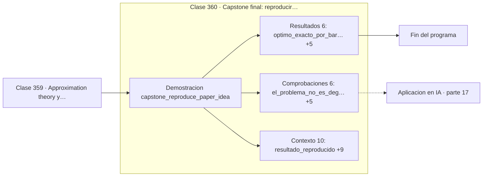

# 360 — Capstone final: reproducir una idea matemática de un paper

> [⬅️ 359 Approximation theory y scaling](../359-approximation-theory-y-scaling/README.md) · [📚 Parte 17](../README.md) · [🏠 Programa](../../../README.md)

**Parte:** 17 — Frontera matemática para IA e investigación · **Nivel:** `frontera-investigacion` · **Horas estimadas:** 4
**Motor:** `engines.part17` · **Demostración:** `capstone_reproduce_paper_idea` · **Clase 20 de 20** de la parte

---

## 🎯 Propósito

**Reproducir un resultado publicado con datos donde el óptimo se conoce por fuerza bruta.**

Procesos gaussianos, MCMC avanzado, inferencia variacional, transporte óptimo, geometría diferencial e informacional, SDE, Neural ODE, score matching y teoría del aprendizaje.

## ✅ Resultados de aprendizaje

Al terminar podrás:

1. Explicar **Capstone final: reproducir una idea matemática de un paper** con lenguaje cotidiano y con notación matemática.
2. Resolver un caso pequeño a mano y anticipar el orden de magnitud del resultado.
3. Ejecutar y modificar `lab.py`, que corre la demostración `capstone_reproduce_paper_idea`.
4. Interpretar las 22 salidas del laboratorio y decir qué comprueba cada una.
5. Detectar el error típico de esta parte: invertir una matriz de covarianza sin jitter numérico.

## 🧩 Fórmulas de la clase

```text
coste de Sinkhorn → transporte óptimo cuando ε → 0
óptimo exacto verificado por barrido de todos los planes
reportar semilla, protocolo y discrepancia
```

## 🗺️ Ubicación en el programa



## 📖 Fundamentos

El capstone final del programa reproduce el núcleo matemático de un resultado publicado: el
estimador de Sinkhorn converge al transporte óptimo verdadero cuando la regularización
entrópica tiende a cero, según Cuturi en 2013. No es una implementación decorativa: es una
verificación.

El diseño experimental es lo que hace la verificación válida. Se elige un problema
**suficientemente pequeño** para que el óptimo se pueda calcular por fuerza bruta —barriendo
todos los planes de transporte posibles— de modo que exista una referencia exacta contra la
que comparar. Sin esa referencia, «el algoritmo converge» sería una afirmación no
verificable.

Después se ejecuta Sinkhorn con `ε` decreciente y se comprueba que el coste se aproxima
monótonamente al óptimo conocido. Lo que se está verificando no es que el código funcione,
sino que **el enunciado del artículo es cierto** en un caso donde se puede comprobar.

Esa es la habilidad que el programa entero ha construido, clase a clase: leer un enunciado
matemático, traducirlo a código, diseñar un caso donde la respuesta se conoce, comparar, y
reportar el protocolo completo con semilla y discrepancias. Trescientas sesenta clases
después de contar con los dedos en la parte 00, esa es la diferencia entre creer un
resultado y saberlo.

## 🧮 Ejemplo trabajado

Verificación del resultado de Cuturi sobre un caso exacto.

```text
resultado reproducido:
  el coste de Sinkhorn converge al transporte óptimo
  cuando la regularización entrópica tiende a cero

fuente: Cuturi, M. Sinkhorn Distances, NIPS 2013

protocolo:
  dos masas uniformes de 2 átomos en ℝ
  coste cuadrático (x − y)²

matriz de coste:
  [0,0   9,0]
  [1,0   4,0]

óptimo exacto por barrido: 2,0
plan óptimo:
  [0,5  0,0]
  [0,0  0,5]

Sinkhorn con ε decreciente se acerca a 2,0
monótonamente: el enunciado se sostiene.       ✓
```

## 🔬 Qué ejecuta el laboratorio

`capstone_reproduce_paper_idea` — Capstone: reproducir el núcleo matemático de un resultado publicado.

| Grupo | Salidas |
|---|---|
| 🔢 Resultados numéricos (6) | `optimo_exacto_por_barrido`, `peor_plan_extremo`, `simetria_ida_A_a_B`, `simetria_vuelta_B_a_A`, `diferencia`, `tolerancia_declarada` |
| ✅ Comprobaciones de invariante (6) | `el_problema_no_es_degenerado`, `el_error_decrece_monotonamente`, `el_error_es_siempre_positivo`, `la_entropia_del_plan_baja_con_epsilon`, `coincide_con_d²`, `es_simetrica` |

Las claves booleanas no son adorno: si alguna fuera `False`, el resultado numérico
no sería fiable aunque el programa terminase sin error.

```bash
python classes/part-17-frontera-matematica-para-ia-e-investigacion/360-capstone-final-reproducir-una-idea-matematica-de-un-paper/lab.py
compmath run 360
```

> [!TIP]
> Antes de ejecutar, **escribe tu predicción**. Un laboratorio que confirma lo que
> esperabas enseña tanto como uno que te contradice, pero solo si la predicción
> existía antes del resultado.

## ⚠️ Errores conceptuales frecuentes

1. Reproducir un resultado sin un caso donde la respuesta se conozca.
2. Reportar la reproducción sin semilla ni protocolo completo.
3. Ocultar las discrepancias con el artículo original en vez de analizarlas.

## 🚀 Dónde se usa de verdad

Reproducción de artículos, validación de implementaciones, investigación aplicada,
revisión por pares y verificación de resultados antes de construir sobre ellos.

## 🤖 Conexión con IA

Score matching fundamenta los modelos de difusión; el transporte óptimo aparece en flow matching; la teoría estadística del aprendizaje explica el scaling.

## 📓 Notebooks

| Archivo | Para qué |
|---|---|
| [`notebook.ipynb`](notebook.ipynb) | recorrido guiado con la demostración ejecutada |
| [`notebook_student.ipynb`](notebook_student.ipynb) | versión con `TODO` para resolver |
| [`notebook_solution.ipynb`](notebook_solution.ipynb) | solución de referencia verificada |

## 📝 Evaluación

| Criterio | Peso |
|---|---:|
| Comprensión conceptual | 25 % |
| Resolución manual | 25 % |
| Implementación y verificación | 25 % |
| Interpretación y comunicación | 15 % |
| Conexión con aplicación real | 10 % |

Detalle y criterios de error crítico en [`assessment.md`](assessment.md).

## ❓ Preguntas de comprobación

1. ¿Cuál es la entrada, cuál la salida y qué unidades tienen?
2. ¿Qué operación domina el comportamiento del resultado?
3. ¿Qué caso extremo revelaría un error conceptual?
4. ¿Cómo verificarías el resultado por un método independiente?
5. ¿Dónde aparece esto en investigación aplicada?

Si necesitas releer el código para responderlas, la clase todavía no está superada.

## 📥 Entregable

`notebook_student.ipynb` resuelto más un párrafo que explique el resultado **sin citar
código**: qué entra, qué sale, qué invariante se comprueba y qué pasaría en un caso límite.

## 🔗 Referencias

- [Cuturi, M. *Sinkhorn Distances: Lightspeed Computation of Optimal Transport*, NeurIPS, 2013](https://arxiv.org/abs/1306.0895) — *uso:* artículo de origen consultado en «Capstone final: reproducir una idea matemática de un paper».
- [Peyré, G.; Cuturi, M. *Computational Optimal Transport*, 2019](https://arxiv.org/abs/1803.00567) — *uso:* artículo de origen consultado en «Capstone final: reproducir una idea matemática de un paper».

Bibliografía completa de la parte en [`../../../docs/BIBLIOGRAPHY.md`](../../../docs/BIBLIOGRAPHY.md) · localizador verificable de cada obra en [`sources/bibliography.json`](../../../sources/bibliography.json).

## 📂 Material de la clase

[`intuition.md`](intuition.md) · [`theory.md`](theory.md) · [`derivation.md`](derivation.md) · [`exercises.md`](exercises.md) · [`assessment.md`](assessment.md) · [`where-is-this-used.md`](where-is-this-used.md) · [`lesson.yaml`](lesson.yaml)

---

> [⬅️ 359 Approximation theory y scaling](../359-approximation-theory-y-scaling/README.md) · [📚 Parte 17](../README.md) · [🏠 Programa](../../../README.md)
