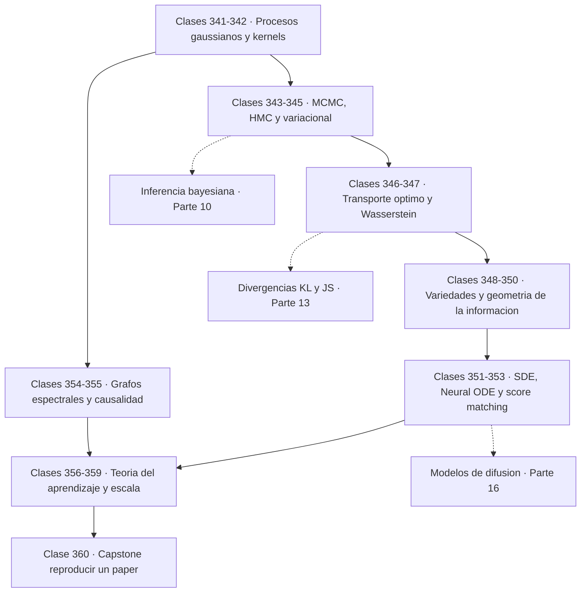

# 🔭 Parte 17 — Frontera matemática para IA e investigación

> [⬅️ Parte 16 — Matemática de Transformers, modelos generativos, grafos y RL](../part-16-matematica-de-transformers-modelos-generativos-grafos-y-rl/README.md) · [🏠 Programa](../../README.md) · [📇 Catálogo](../README.md)

**Nivel:** `frontera-investigacion` · **Clases:** 20 · **Horas estimadas:** 80 · **Motor:** [`part17.py`](../../src/computational_math/engines/part17.py)

---

## 🎯 De qué trata esta parte

Procesos gaussianos, MCMC avanzado, inferencia variacional, transporte óptimo, geometría diferencial e informacional, SDE, Neural ODE, score matching y teoría del aprendizaje.

Esta última parte recorre la matemática que aparece en los artículos de investigación
actuales y que rara vez se enseña en un curso introductorio. No es un apéndice decorativo:
score matching **es** el fundamento de los modelos de difusión, el transporte óptimo aparece
en flow matching, y la teoría estadística del aprendizaje es lo que da marco a las leyes de
escala. Quien quiera leer papers y reproducirlos necesita estas herramientas.

Las clases 341 a 345 tratan la inferencia. Un **proceso gaussiano** define una distribución
sobre **funciones** en vez de sobre parámetros, y su virtud es que la incertidumbre es
honesta: mínima donde hay datos, y de vuelta al prior donde no los hay. Los métodos de
muestreo aparecen con su diagnóstico obligatorio: Metropolis-Hastings tiene una tasa de
aceptación óptima cercana a 0,44 y un paso mal elegido produce cadenas que aceptan casi todo
y no exploran nada. **HMC** usa el gradiente para proponer estados lejanos con altísima
aceptación, y la **inferencia variacional** cambia muestrear por optimizar.

Las clases 346 y 347 introducen el **transporte óptimo**, que responde a cuánto cuesta mover
una distribución hasta otra. Su ventaja decisiva sobre la KL es que funciona **sin soporte
común**: cuando dos distribuciones no se solapan, la KL es infinita o constante y su gradiente
inútil, mientras que Wasserstein sigue midiendo la separación real. Eso es exactamente lo que
arregló WGAN, y lo que hace del transporte óptimo el lenguaje del flow matching.

Las clases 348 a 350 aportan geometría. La **hipótesis de la variedad** —los datos reales
viven en una variedad de dimensión intrínseca mucho menor que la del espacio ambiente— es lo
que explica que el aprendizaje sea posible en dimensión alta. La **geometría de la
información** dota al espacio de parámetros de una métrica natural: la información de Fisher
es la curvatura local de la divergencia KL, y de ahí salen la cota de Cramér-Rao y el
gradiente natural, invariante a reparametrizaciones.

Las clases 351 a 355 tratan la dinámica y la causalidad. Las **ecuaciones diferenciales
estocásticas** describen procesos con ruido continuo y son la formulación en tiempo continuo
de la difusión; los **Neural ODE** tratan la profundidad como variable continua y usan el
método adjunto para no almacenar toda la trayectoria; el **score matching** aprende
`∇ log p` sin necesitar la constante de normalización, que es precisamente la cantidad
intratable; y la **inferencia causal** muestra con números cómo el ajuste por puerta trasera
recupera un efecto real de cero que la correlación cruda estimaba en 1,02.

El cierre (356 a 359) es teoría del aprendizaje: riesgo empírico frente a riesgo verdadero,
dimensión VC, cotas PAC y teoría de aproximación. Conviene decir con claridad qué aportan y
qué no. Las cotas PAC son correctas y **enormemente holgadas** en la práctica: predicen que
las redes profundas no deberían generalizar y generalizan. Su valor es cualitativo —cómo
escala la muestra necesaria con `1/ε` y con la complejidad— no cuantitativo.

El capstone reproduce el núcleo matemático de un resultado publicado: el estimador de Sinkhorn
converge al transporte óptimo cuando la regularización entrópica tiende a cero. Verificar un
resultado de un artículo con código propio y datos donde el óptimo se conoce por fuerza bruta
es la habilidad que este programa entero ha estado construyendo desde la primera clase.

## 🗺️ Mapa conceptual



## 🧠 Ideas centrales

- Un proceso gaussiano define una distribución sobre funciones, no sobre parámetros.
- HMC usa gradientes para proponer estados lejanos con alta aceptación.
- La distancia de Wasserstein compara distribuciones sin exigir soporte común.
- La geometría de la información dota al espacio de parámetros de una métrica natural.
- Las cotas PAC acotan el error esperado, no garantizan el error observado.

## 🤖 Por qué importa en IA

> [!IMPORTANT]
> Score matching fundamenta los modelos de difusión; el transporte óptimo aparece en flow matching; la teoría estadística del aprendizaje explica el scaling.

## ⚠️ Errores frecuentes de esta parte

- Reportar resultados de MCMC sin diagnóstico de convergencia.
- Invertir una matriz de covarianza sin jitter numérico.
- Interpretar una cota teórica como predicción del error real.

## 🧭 Secuencia de la parte


## 📚 Las clases

| # | Clase | Demostración | Idea central |
|---|---|---|---|
| `341` | [Gaussian Processes](341-gaussian-processes/README.md) | `gaussian_processes` | Un proceso gaussiano distribuye sobre funciones, y su incertidumbre crece donde no hay datos. |
| `342` | [Kernel methods avanzados](342-kernel-methods-avanzados/README.md) | `advanced_kernels` | Una función es kernel válido si y solo si su matriz de Gram es siempre semidefinida positiva. |
| `343` | [MCMC avanzado](343-mcmc-avanzado/README.md) | `advanced_mcmc` | Aceptar el 95 % de las propuestas no es buena señal: significa que no se explora. |
| `344` | [Hamiltonian Monte Carlo](344-hamiltonian-monte-carlo/README.md) | `hamiltonian_monte_carlo` | Con gradientes se proponen estados lejanos que se aceptan el 99,8 % de las veces. |
| `345` | [Variational inference avanzada](345-variational-inference-avanzada/README.md) | `advanced_variational_inference` | Cambiar muestreo por optimización: más rápido, aproximado y con sesgo conocido. |
| `346` | [Optimal transport](346-optimal-transport/README.md) | `optimal_transport` | Sinkhorn convierte un problema de programación lineal en escalados alternos. |
| `347` | [Wasserstein distance](347-wasserstein-distance/README.md) | `wasserstein_distance` | Wasserstein mide la separación real cuando la KL se vuelve infinita o constante. |
| `348` | [Manifold learning](348-manifold-learning/README.md) | `manifold_learning` | PCA no encuentra una variedad curva: ve tres dimensiones donde solo hay una. |
| `349` | [Geometría diferencial para ML](349-geometria-diferencial-para-ml/README.md) | `differential_geometry` | La longitud de una curva es la integral de su rapidez, y eso se verifica numéricamente. |
| `350` | [Information geometry](350-information-geometry/README.md) | `information_geometry` | La información de Fisher es la curvatura de la KL, y de ella salen Cramér-Rao y el gradiente natural. |
| `351` | [Stochastic differential equations](351-stochastic-differential-equations/README.md) | `stochastic_differential_equations` | En una SDE el ruido escala como √dt, no como dt: esa raíz lo cambia todo. |
| `352` | [Neural ODEs](352-neural-odes/README.md) | `neural_odes` | El método adjunto calcula gradientes con memoria constante, sin guardar la trayectoria. |
| `353` | [Score matching](353-score-matching/README.md) | `score_matching` | El score no depende de la constante de normalización, y esa es precisamente la parte intratable. |
| `354` | [Spectral graph theory](354-spectral-graph-theory/README.md) | `spectral_graph_theory` | El signo del vector de Fiedler dice por dónde partir el grafo en dos. |
| `355` | [Causal inference](355-causal-inference/README.md) | `causal_inference` | El coeficiente sin ajustar estima 1,02 un efecto que en realidad es cero. |
| `356` | [Statistical learning theory](356-statistical-learning-theory/README.md) | `statistical_learning_theory` | Con 25 parámetros y 30 datos se acierta el 80 % en entrenamiento sobre etiquetas aleatorias. |
| `357` | [VC dimension](357-vc-dimension/README.md) | `vc_dimension` | Una clase con infinitas hipótesis puede tener dimensión VC igual a 1. |
| `358` | [PAC learning](358-pac-learning/README.md) | `pac_learning` | Reducir el error a la mitad duplica los datos; subir la confianza cuesta un logaritmo. |
| `359` | [Approximation theory y scaling](359-approximation-theory-y-scaling/README.md) | `approximation_theory` | El error decae como una potencia del tamaño, y ese exponente es lo que predice el escalado. |
| `360` | [Capstone final: reproducir una idea matemática de un paper](360-capstone-final-reproducir-una-idea-matematica-de-un-paper/README.md) | `capstone_reproduce_paper_idea` | Reproducir un resultado publicado con datos donde el óptimo se conoce por fuerza bruta. |

## 📖 Glosario de la parte (38 términos)

Definiciones precisas en [`GLOSARIO.md`](GLOSARIO.md).

## 🧰 Stack de referencia

`math`, `random`, `numpy (opcional)`, `pymc/jax (opcional)`

Los laboratorios se ejecutan con biblioteca estándar; estas herramientas aparecen
como contraste profesional, no como requisito.

## 🧪 Ejecutar toda la parte

```bash
compmath run --part 17
compmath catalog --part 17
```

## 📊 Evaluación de la parte

| Componente | Peso |
|---|---:|
| Clases y ejercicios | 40 % |
| Laboratorios y notebooks | 25 % |
| Explicación oral o escrita | 15 % |
| Capstone ([360](360-capstone-final-reproducir-una-idea-matematica-de-un-paper/README.md)) | 20 % |

## 📖 Bibliografía

- Rasmussen, C.; Williams, C. *Gaussian Processes for Machine Learning*. MIT Press, 2006.
- Neal, R. *MCMC using Hamiltonian dynamics*. Handbook of MCMC, 2011.
- Peyré, G.; Cuturi, M. *Computational Optimal Transport*. 2019.
- Shalev-Shwartz, S.; Ben-David, S. *Understanding Machine Learning*. Cambridge, 2014.

---

> [⬅️ Parte 16 — Matemática de Transformers, modelos generativos, grafos y RL](../part-16-matematica-de-transformers-modelos-generativos-grafos-y-rl/README.md) · [🏠 Programa](../../README.md) · [📇 Catálogo](../README.md)
