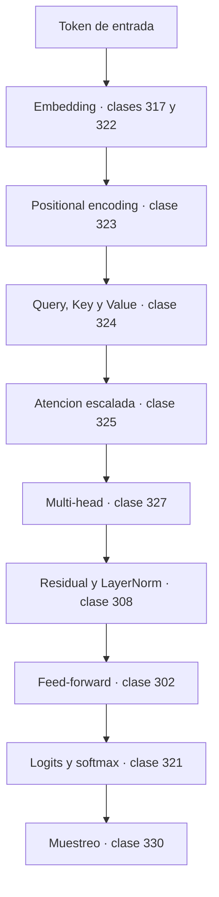

# Mapa matemático de la Inteligencia Artificial

Qué matemática necesita cada componente de un modelo moderno, y en qué clase de este
programa se estudia.

## Cómo leer este mapa

Cada fila apunta a una clase concreta que **ejecuta** el concepto:

```bash
compmath show 325     # ficha de la clase
compmath run 325      # ejecutar su demostración
```

## Transformer



| Componente | Matemática | Clases |
|---|---|---|
| Embeddings | espacios vectoriales, similitud coseno | 103, 317, 322 |
| Positional encoding | funciones trigonométricas, periodicidad | 065, 323 |
| Q, K, V | transformaciones lineales | 110, 123, 324 |
| Producto punto escalado | producto interno, varianza en alta dimensión | 103, 190, 325 |
| Softmax | exponencial, distribución categórica, estabilidad numérica | 055, 321, 033 |
| Máscara causal | modelado autoregresivo, regla de la cadena de probabilidad | 183, 329 |
| Multi-head | descomposición en subespacios | 108, 327 |
| LayerNorm | media, varianza, estandarización | 190, 308 |
| Residual | composición de funciones, gradiente | 057, 147, 306 |
| Feed-forward | composición no lineal | 302, 303 |
| Cross-entropy | entropía, verosimilitud | 263, 286 |
| Sampling | temperatura, top-k, top-p | 330 |
| Entrenamiento | AdamW, warmup, clipping | 250, 251, 318 |

## Redes neuronales

| Bloque | Matemática | Clases |
|---|---|---|
| Capa densa | producto matriz-vector | 110, 111 |
| Activaciones | funciones por tramos, derivadas | 059, 303 |
| Pérdidas | MSE, cross-entropy, verosimilitud | 215, 304 |
| Backpropagation | regla de la cadena, orden topológico inverso | 147, 167, 305 |
| Autodiferenciación | grafo de cómputo, modo reverso | 179, 306, 319 |
| Inicialización | varianza, escalado por fan-in | 190, 307 |
| Normalización | estandarización por eje | 308 |
| Dropout | esperanza, escalado inverso | 189, 309 |
| Convolución | convolución discreta, campo receptivo | 271, 310, 311 |
| Pooling | reducción, gradiente disperso | 312 |
| Recurrencia | recurrencias, producto de derivadas | 092, 313, 314 |
| LSTM / GRU | compuertas, camino aditivo del gradiente | 315, 316 |

## Modelos generativos

| Familia | Matemática | Clases |
|---|---|---|
| VAE | inferencia variacional, KL, reparametrización | 264, 331, 332, 345 |
| ELBO | cota inferior de la verosimilitud | 215, 332 |
| GAN | juegos minimax, divergencia Jensen-Shannon | 265, 333 |
| Difusión (directo) | procesos estocásticos, SDE | 199, 334, 351 |
| Difusión (inverso) | score matching, gradiente de la log-densidad | 335, 353 |
| Flow matching | transporte óptimo, Wasserstein | 346, 347 |
| Autoregresivo | regla de la cadena de la probabilidad | 183, 329 |

## Machine Learning clásico

| Algoritmo | Se deriva de | Clase |
|---|---|---|
| Regresión lineal | mínimos cuadrados | 131, 282 |
| Ridge | norma L2 y condicionamiento | 104, 283 |
| Lasso | norma L1 y geometría del óptimo | 104, 284 |
| Regresión logística | log-verosimilitud + sigmoide | 215, 285 |
| Naive Bayes | Bayes + independencia condicional | 186, 287 |
| k-NN | métricas y maldición de la dimensión | 104, 288 |
| SVM | margen máximo, hinge loss | 289 |
| Kernel trick | producto interno implícito, Mercer | 290, 342 |
| Árboles | entropía y Gini | 262, 291 |
| Random Forest | varianza de una media correlacionada | 190, 292 |
| Boosting | descenso de gradiente funcional | 243, 293 |
| k-means | minimización de inercia | 294 |
| GMM / EM | verosimilitud con variable latente | 295, 296 |
| PCA | autovalores de la covarianza / SVD | 135, 297 |

## Reinforcement Learning

| Concepto | Matemática | Clase |
|---|---|---|
| MDP y retorno | cadenas de Markov, series geométricas | 199, 338 |
| Ecuaciones de Bellman | punto fijo, operador contractivo | 338 |
| Iteración de valor | convergencia de contracciones | 338 |
| Policy gradients | gradiente del logaritmo, esperanza | 148, 339 |
| Baseline y ventaja | reducción de varianza sin sesgo | 190, 339 |
| Exploración | probabilidad, entropía | 182, 262 |

## Grafos y GNN

| Concepto | Matemática | Clase |
|---|---|---|
| Grafo, grado, camino | matemática discreta | 093, 094 |
| Matriz de adyacencia | álgebra lineal sobre grafos | 109, 336 |
| Laplaciano | espectro, componentes conexas | 125, 336, 354 |
| Message passing | agregación normalizada | 337 |
| Clustering espectral | vector de Fiedler | 354 |

## Numérico y de infraestructura

| Problema real | Matemática | Clase |
|---|---|---|
| Aparecen `NaN` en el entrenamiento | overflow, `log(0)`, cancelación | 032, 033, 263 |
| El entrenamiento diverge | learning rate frente a curvatura | 244, 169 |
| float16 / bfloat16 / cuantización | IEEE 754, ULP, error relativo | 028, 030, 031 |
| Resultados irreproducibles | orden de operaciones en punto flotante | 039 |
| Matriz mal condicionada | número de condición, SVD | 035, 132 |
| Métricas demasiado buenas | leakage, validación | 299 |
| Comparar dos modelos | prueba de hipótesis, potencia, IC | 205, 206, 209 |

## Frontera de investigación

| Línea | Matemática | Clase |
|---|---|---|
| Optimización bayesiana | procesos gaussianos | 341 |
| Inferencia escalable | HMC, VI avanzada | 344, 345 |
| Modelos continuos | SDE, Neural ODE | 351, 352 |
| Geometría de la representación | variedades, geometría diferencial | 348, 349 |
| Gradiente natural | geometría de la información | 350 |
| Causalidad | backdoor, colisionadores | 355 |
| Leyes de escala | teoría de aproximación, PAC | 356, 357, 358, 359 |

## Prerrequisito mínimo por objetivo

| Quiero… | Necesito como mínimo |
|---|---|
| Entender una capa densa | 103, 110, 111 |
| Entender backpropagation | 144, 147, 164, 305 |
| Entender la atención | 103, 321, 322, 325 |
| Entender por qué mi loss es cross-entropy | 262, 263, 215 |
| Entender Adam | 243, 244, 246, 250 |
| Entender difusión | 194, 199, 334, 335, 353 |
| Evaluar un modelo sin engañarme | 205, 206, 207, 299 |
