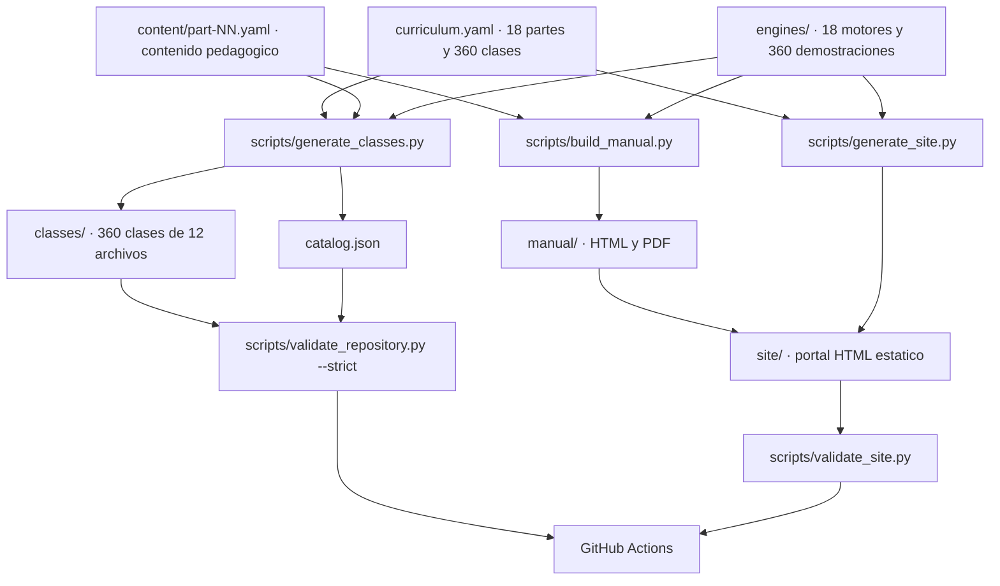

# Arquitectura del programa

## Principio rector

Hay **una sola fuente de verdad** (`curriculum.yaml`) y **una sola fuente de cálculo**
(los 18 motores). Todo lo demás —las 360 clases, el catálogo, el portal web— es
artefacto derivado y se regenera con un comando.



## Árbol del repositorio

```text
curriculum.yaml                 fuente de verdad del currículo
content/part-NN.yaml            contenido pedagógico: fundamentos, ejemplos y glosario
catalog.json                    catálogo derivado (verificado contra el currículo)

src/computational_math/
├── __init__.py                 versión y reexportaciones
├── curriculum.py               acceso al currículo, catálogo y rutas de clase
├── content.py                  acceso al contenido pedagógico y su cobertura real
├── sources.py                  registro de fuentes: identificadores, uso por clase y cifras
├── cli.py                      CLI `compmath`
├── helpers.py                  utilidades numéricas de biblioteca estándar
└── engines/
    ├── __init__.py             carga de motores y mapeo clase → demostración
    ├── _linalg.py              álgebra lineal en Python puro
    └── part00.py … part17.py   un motor por parte, 20 demostraciones cada uno

classes/part-NN-<slug>/
├── README.md                   índice y evaluación de la parte
└── NNN-<slug>/                 una clase: 12 archivos generados

scripts/
├── generate_classes.py         currículo + contenido + motores → clases y catálogo
├── generate_site.py            → site/ (incluye el manual descargable)
├── build_manual.py             → manual/ en HTML y PDF
├── run_capstone_labs.py        ejecuta los 18 capstone como procesos independientes
├── validate_repository.py      coherencia global (modo --strict en CI)
├── verify_sources.py           trazabilidad de fuentes, offline y determinista (CI)
├── refresh_sources.py          resolución en red del registro (manual, no bloquea)
├── validate_site.py            artefacto de Pages antes de publicar
└── validate_pages.py           sitio ya publicado, tras el despliegue

sources/                        registro de fuentes con localizador por obra
tests/                          currículo, contenido, motores, estructura, CLI, sitio y manual
docs/                           documentación del programa
learning-paths/                 12 rutas por perfil profesional
site/                           portal estático (generado, no versionado)
manual/                         manual completo HTML y PDF (generado, no versionado)
```

## Las cuatro capas

### 1. Declaración — `curriculum.yaml` y `content/`

Contiene, por cada una de las 18 partes: identificador, slug, título, nivel, motor
asociado, resumen, aplicaciones, conexión con IA, ideas centrales, errores frecuentes,
stack de referencia, bibliografía primaria y la lista ordenada de sus 20 clases.

No contiene prosa de clase. La metadata vive aquí; la **prosa pedagógica** vive en
`content/part-NN.yaml`, que aporta por parte un resumen extendido, un mapa conceptual y
un glosario, y por clase concepto, fórmulas, fundamentos, ejemplo trabajado, errores
conceptuales, aplicación y referencias con enlace.

El contenido es **opcional por clase**: si una clase no tiene registro, el generador usa
el material base en lugar de dejar un hueco. `compmath stats` y el manual declaran la
cobertura real, sin redondearla al alza.

Los diagramas Mermaid de todo el repositorio se escriben **sin HTML**: un renderizador
con `htmlLabels` desactivado descarta las etiquetas y pega las palabras, así que las
etiquetas usan el separador `·` y se recortan por palabra. Un test lo verifica.

### 2. Cálculo — `src/computational_math/engines/`

Un módulo por parte. Cada módulo expone:

| Símbolo | Qué es |
|---|---|
| `PART`, `TITLE` | identificación de la parte |
| `DEMOS` | `dict[str, Callable[[], dict]]` con las demostraciones |
| `CLASS_DEMOS` | `dict[str, str]` que mapea cada clase a su demostración |

Contrato de una demostración:

1. No recibe argumentos y devuelve un `dict` no vacío.
2. Es **determinista**: dos llamadas devuelven exactamente lo mismo.
3. Usa **solo biblioteca estándar**; cualquier dependencia externa va en `try/except`.
4. Su docstring de una línea describe qué demuestra —ese texto se propaga a la clase
   generada y al sitio.
5. Devuelve, además de resultados, **claves de verificación**: booleanos o residuos que
   comprueban un invariante (`coinciden`, `es_simetrica`, `residuo`, `error`).

`_linalg.py` centraliza lo que varios motores necesitan: eliminación gaussiana con
pivoteo parcial, determinante, rango, inversa, Gram-Schmidt, QR, LU, iteración de
potencias, autovalores simétricos por Jacobi, SVD y covarianza.

### 3. Derivación — `scripts/`

`generate_classes.py` recorre el currículo, ejecuta la demostración de cada clase para
leer sus salidas reales y escribe los 12 archivos. En modo `--check` no escribe nada y
falla si algún archivo del repositorio difiere de lo que generaría: eso es lo que impide
que una edición manual sobreviva.

`generate_site.py` produce `site/` completo: índice con buscador, 18 páginas de parte,
360 páginas de clase, hoja de estilo, JavaScript, manifest, service worker, `robots.txt`
y `sitemap.xml`. Sin CDN, sin fuentes remotas y sin analítica.

El portal publica también la capa de `content/`: cada página de parte lleva su panorama,
su recorrido y su glosario, y cada página de clase su concepto, fórmulas, desarrollo,
ejemplo trabajado, errores y fuentes. El mapa Mermaid **no se incrusta** —eso exigiría
cargar una biblioteca externa y el sitio no carga ninguna—: sus aristas se extraen y se
publican como recorrido en HTML plano.

Los enlaces a las fuentes sí salen del dominio, y esa es la única excepción permitida:
`validate_site.py` distingue un **recurso** (`src`, o el `href` de un `<link>`, que el
navegador descarga al abrir la página) de un **enlace de navegación** (`href` de `<a>`,
que no se descarga). Los recursos externos siguen prohibidos; las citas pueden apuntar a
su origen.

### 4. Trazabilidad — `sources/`

`sources/bibliography.json` es la cuarta capa: una entrada por obra citada, con
localizador resoluble (ISBN-13, DOI o URL de la fuente primaria), la autoridad que
responde por él y un estado. `verify_sources.py` la comprueba **sin red** —esquema,
dígito de control, forma canónica del localizador, cobertura, bloques de fuentes
repetidos y las cifras que publica el README—, y `refresh_sources.py` la resuelve
**con red** contra Open Library, Crossref y DataCite. Están separados a propósito: un
verificador que depende de la red acaba ignorándose. Detalle en
[`sources/README.md`](../sources/README.md).

## Contrato de clase

Los 12 archivos de cada clase, y qué garantiza cada uno:

| Archivo | Contenido | Validado por |
|---|---|---|
| `README.md` | propósito, resultados, demostración, salidas, errores, referencias | menciona título y `compmath run` |
| `intuition.md` | pregunta previa, analogía con límites, predicción obligatoria | existe y no está vacío |
| `theory.md` | modelo / algoritmo / representación; ideas de la parte | existe y no está vacío |
| `derivation.md` | método de derivación y contraste con el código | existe y no está vacío |
| `exercises.md` | 10 ejercicios en tres niveles y reto de la parte | existe y no está vacío |
| `assessment.md` | rúbrica ponderada y errores críticos | existe y no está vacío |
| `where-is-this-used.md` | aplicaciones y repositorios conectados | existe y no está vacío |
| `lesson.yaml` | metadata, demostración, salidas y los 12 artefactos | declara los 12 archivos |
| `lab.py` | ejecuta la demostración de su parte | compila e importa su motor |
| `notebook.ipynb` | recorrido guiado | nbformat 4 con celdas válidas |
| `notebook_student.ipynb` | versión con `TODO` | contiene `TODO` |
| `notebook_solution.ipynb` | solución con verificaciones | **no** contiene `TODO` |

## Flujo de validación

```bash
python scripts/generate_classes.py --check     # nada quedó desfasado
python scripts/validate_repository.py --strict # coherencia + 360 laboratorios + versiones
python scripts/verify_sources.py               # trazabilidad de fuentes, sin tocar la red
python -m unittest discover -s tests -v        # contrato, motores, CLI y sitio
python scripts/generate_site.py                # construir el portal
python scripts/validate_site.py                # enlaces, conteos y cero recursos externos
```

CI ejecuta exactamente esos comandos. Un job final exige que todos los anteriores hayan
terminado en `success`: no hay verde parcial.

## Decisiones de diseño y su coste

| Decisión | Beneficio | Coste aceptado |
|---|---|---|
| Motores en Python puro | se ejecutan en cualquier parte, sin instalar nada | órdenes de magnitud más lentos que NumPy |
| Clases generadas | coherencia garantizada entre 360 clases | no se puede escribir prosa única por clase sin tocar el generador |
| Semillas fijas | resultados reproducibles y testeables | los resultados estocásticos son ilustrativos, no muestrales |
| Sitio sin dependencias | funciona offline y no rompe por un CDN caído | sin resaltado de sintaxis ni renderizado de LaTeX |
| Una demostración por clase | cada clase tiene algo real que ejecutar | una demostración no agota el contenido de su clase |

## Principios

1. Cero prerrequisitos ocultos.
2. Derivación antes que abstracción de biblioteca.
3. Código mínimo reproducible y legible por encima de rápido.
4. Error numérico explícito, con tolerancia declarada.
5. Conexión con aplicaciones reales, sin exagerarla.
6. No duplicar los programas especializados del ecosistema.
7. Ninguna afirmación del repositorio que el repositorio no pueda verificar.
