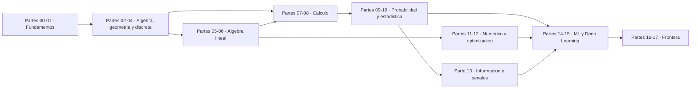

# Ruta de aprendizaje

## Elige tu punto de partida

| Si esto te describe… | Empieza en | Por qué |
|---|---|---|
| «Las fracciones y los porcentajes me cuestan» | **Parte 00** | reconstruye la aritmética con rigor de programador |
| «Sé aritmética pero nunca entendí por qué `0.1+0.2 != 0.3`» | **Parte 01** | representación numérica, error y estabilidad |
| «Programo, pero el álgebra la olvidé» | **Parte 02** | funciones, dominio, logaritmos y composición |
| «Sé álgebra; quiero llegar a ML» | **Parte 05** | álgebra lineal es el objeto central de todo modelo |
| «Sé álgebra lineal; no entiendo backpropagation» | **Parte 07** | derivada, regla de la cadena y autodiferenciación |
| «Entiendo redes; quiero leer papers» | **Parte 16** | atención, generativos, grafos y RL |

Si dudas, empieza en la 00. Las primeras partes son rápidas para quien ya sabe y
esenciales para quien no.

## Ruta completa (360 clases · ~1440 h)



| Bloque | Partes | Clases | Qué desbloquea |
|---|---|---:|---|
| Fundamentos | 00, 01 | 40 | leer cualquier número sin engañarte |
| Lenguaje matemático | 02, 03, 04 | 60 | leer cualquier fórmula y demostrar |
| Álgebra lineal | 05, 06 | 40 | representar datos y transformarlos |
| Cálculo | 07, 08 | 40 | entrenar por gradiente |
| Incertidumbre | 09, 10 | 40 | saber si un resultado significa algo |
| Cómputo | 11, 12 | 40 | calcular lo que no tiene forma cerrada |
| Información | 13 | 20 | funciones de pérdida y convolución |
| Aplicación | 14, 15 | 40 | derivar los algoritmos, no solo usarlos |
| Frontera | 16, 17 | 40 | leer y reproducir papers |

## Rutas cortas

### Backpropagation sin magia — 80 clases

Partes **05, 07, 08, 15**. Termina implementando una red desde cero que separa dos
espirales, y comprobando que tu derivación manual coincide con la autodiferenciación.

### Leer papers de Transformers — 120 clases

Partes **05, 06, 08, 09, 13, 16**. Termina con un mini-Transformer causal cuyo sesgo
de posición relativa aprende a mirar el token anterior.

### Ciencia de datos honesta — 120 clases

Partes **00, 02, 05, 09, 10, 14**. El foco no es entrenar modelos, sino no engañarte:
p-values, potencia, intervalos, leakage y sesgo-varianza.

### Ingeniería y simulación — 100 clases

Partes **01, 05, 07, 11, 12**. Precisión, condicionamiento, solvers, EDO y optimización
con restricciones.

### Solo lo mínimo para IA — 140 clases

Partes **01, 05, 06, 08, 09, 12, 13**. La matemática que un practicante de IA usa a
diario sin saber que la usa.

Las 12 [rutas por perfil profesional](../learning-paths/) desglosan estos recorridos
clase a clase.

## Criterio de avance

No basta con leer. Para dar una parte por superada:

- [ ] ≥ 80 % de los ejercicios básicos resueltos;
- [ ] al menos 15 de los 20 laboratorios ejecutados **con predicción escrita previa**;
- [ ] los 20 notebooks de estudiante intentados antes de mirar la solución;
- [ ] el capstone de la parte entregado;
- [ ] las cinco preguntas de comprobación respondidas **sin mirar el código**.

```bash
compmath run --part 09          # comprobar que ejecutas toda la parte
compmath progress               # ver tu avance
compmath progress --done 181 182 183
```

## Prerrequisitos entre partes

| Parte | Requiere | Motivo |
|---|---|---|
| 05 | 02 | funciones y notación |
| 06 | 05 | descomposiciones sobre matrices |
| 07 | 02 | límites sobre funciones |
| 08 | 05, 07 | gradiente = derivadas + vectores |
| 09 | 04 | probabilidad se apoya en conteo |
| 10 | 09 | inferencia se apoya en distribuciones |
| 11 | 01, 05 | error numérico y sistemas lineales |
| 12 | 07, 08 | descenso necesita gradiente |
| 13 | 09 | entropía se define sobre distribuciones |
| 14 | 05, 09, 12 | objetivo + probabilidad + optimización |
| 15 | 08, 14 | backpropagation y funciones de pérdida |
| 16 | 05, 13, 15 | atención, softmax y arquitecturas |
| 17 | 09, 10, 12, 16 | todo lo anterior |

## Cuánto tiempo lleva de verdad

| Dedicación | Ruta completa | Ruta corta de 80 clases |
|---|---|---|
| 25 h/semana | ~14 meses | ~3 meses |
| 10 h/semana | ~2,8 años | ~8 meses |
| 5 h/semana | ~5,5 años | ~16 meses |

Nadie termina 360 clases en un trimestre. Elegir una ruta corta y terminarla vale más
que empezar la completa y abandonarla en la parte 04.
